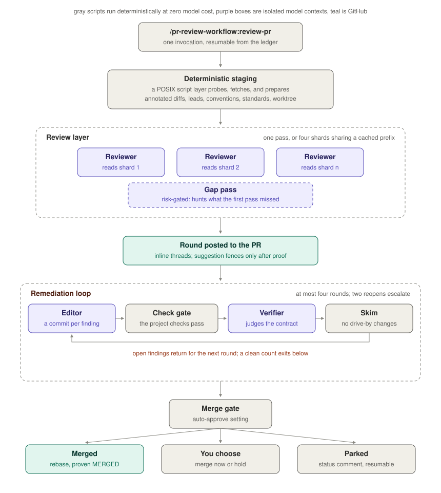

# pr-review-workflow

A Claude Code plugin that runs the full loop of reviewing a GitHub pull
request: review the diff against categorized criteria, post inline findings,
edit the branch to address them, re-verify with a cheaper model, and repeat
until nothing remains open. Then it merges, or asks you first.

<p align="center"></p>

## Status

First release cut. The full loop has run against live pull requests:
review, inline findings with a proven suggestion, per-finding fix
commits, thread resolution, and a proven rebase merge. Interactive
hardening across more repositories is the current work.

## Requirements

- `git`
- The GitHub CLI, authenticated. The plugin shells out to it and never
  handles a token itself.
- A local clone of the repository whose pull request you are reviewing; the
  skill runs from inside it.

Nothing else. The plugin has no runtime dependencies, no build step, and
nothing to install beyond itself.

## What it does to your repository

Read this before installing. The plugin reads pull requests, posts review
comments to them, pushes commits to their branches, and merges when told to.
It acts with whatever access your GitHub CLI credentials carry. With the
check command configured, it also runs that command against pull request
code (see SECURITY.md).

## Usage

From a clone of the reviewed repository:

```text
/pr-review-workflow:review-pr 128
```

Also accepted: `owner/repo#128` or the pull request URL.

The loop: a reviewer agent reads the fetched diff (split, line-annotated,
never entering the orchestrating context) and files findings in seven
categories (correctness, security, performance, best practices,
antipatterns, content leakage, outdated docs). Findings post as inline
comments; suggested-change blocks appear only after being applied and
checked in a scratch worktree. An editor agent fixes each finding with its
own commit and replies to each thread; a verifier agent re-checks only the
claimed fixes, resolving threads or reopening them. When nothing is open,
the merge gate runs.

### Settings

Configured when you enable the plugin:

| Option | Default | Meaning |
| --- | --- | --- |
| Auto-approve on convergence | off | Merge without asking once the loop is clean. When off, you get a prompt: merge now or hold. |
| Check command | empty | The reviewed repository's own check command, used to prove suggestions. Empty restricts suggestions to fixes that apply cleanly. |
| Local standards files | empty | Globs, relative to your clone, of untracked files holding the project's own rules. Their substance guides every category of the review; their names and text never reach the pull request. |
| Second review pass | risky | When a gap pass runs after a single-reviewer first review: off, risky (secrets or automation probes fired), or always. It reads the existing findings and reports only what they miss. A sharded review always ends with one, whatever this is set to: shards read disjoint file sets, so only a whole-diff pass sees defects that span them. |
| Ledgers kept per repository | 20 | Finished finding ledgers retained per repository after each merge; older ones are pruned, and runs still holding a worktree never are. |
| Reviewer / editor / verifier model | inherit / inherit / sonnet | Model per role. The first review deserves your strongest model; verification passes are cheap by design. |
| Model routing | auto | auto picks cheaper models where the work is mechanical: a small docs-only or config-only change with no risk probes gets a sonnet reviewer, a first editing round whose findings are all minor and fence-backed gets a sonnet editor, and a finding reopened past the limit gets one strong arbitration pass before the run parks, since repeated reopens sometimes mean the cheap verifier is wrong. The gap pass never routes down. fixed always uses the configured models. |

### Conventions block (optional)

Give the reviewed repository a marked block in its tracked CLAUDE.md
(see skills/review-pr/project-conventions.md) mapping its layout, test
locations, idioms, and intentional oddities. Reviews read the map from
the base branch instead of re-deriving those facts every run, and the
same file already guides Claude when developing on the repository.

### State

Per-PR state lives under the plugin's data directory, outside every
repository: the finding ledger, fetched context, and a detached review
worktree. Re-invoking the skill on the same pull request resumes from the
ledger. Your own checkout is never touched.
State is keyed by repository and pull request, so every worktree of a
clone shares it, and local rule files are found from a linked worktree
by looking in the main one. Run one review per pull request at a time.

<p align="center"></p>

### Limits

- Fork pull requests: full loop when the fork allows maintainer edits;
  review-only (findings and suggestions post, nothing is fixed) when it
  does not.
- Pull requests past the GitHub API diff limits are parked as too large.
- Unattended runs never merge unless auto-approve is on; they park with a
  status comment instead.

## Development

Run the gate before every commit:

```sh
sh scripts/gate.sh
```

Activate the pre-commit hook once per clone:

```sh
git config core.hooksPath .githooks
```

See CONTRIBUTING.md for branch naming, commit style, and the review loop
every change goes through.

## Project structure

- `.claude-plugin/plugin.json`: manifest and settings.
- `skills/review-pr/`: the orchestrating skill and the finding record format.
- `agents/`: reviewer, editor, and verifier definitions.
- `scripts/`: POSIX sh, one proven step each.
- `tests/`: offline suite with a stubbed GitHub CLI.
